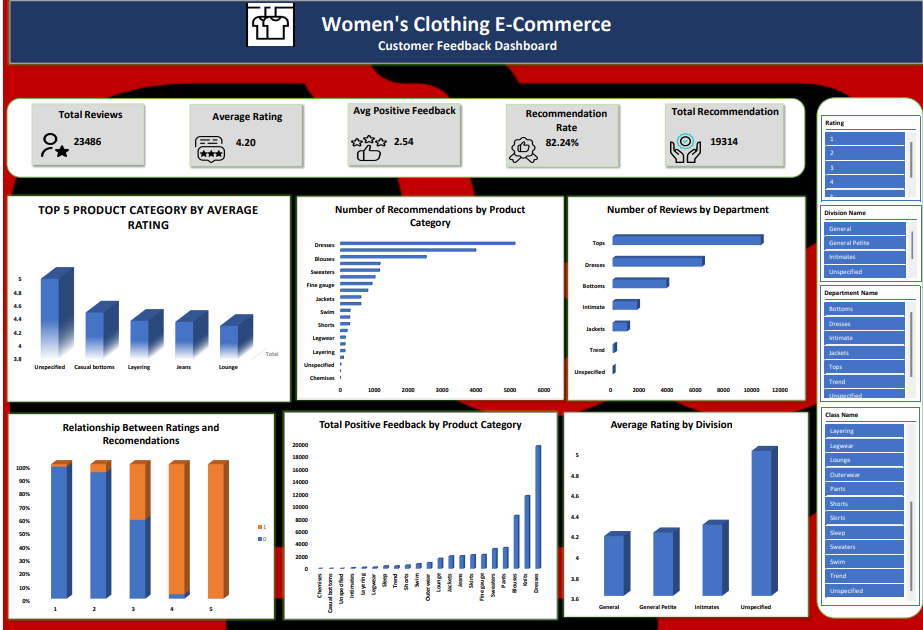

# Women's Clothing E-Commerce Customer Feedback Analysis

## Project Overview

This project analyzes over 23,000 customer reviews from a women's clothing e-commerce company to understand customer satisfaction, product performance, and recommendation patterns. Using Microsoft Excel, the dashboard uncovers insights into customer ratings, product recommendations, department performance, and customer feedback to support data-driven business decisions.

## Objectives

- Analyze customer ratings across product categories.
- Identify the most recommended product categories.
- Examine review distribution across departments.
- Explore the relationship between customer ratings and recommendations.
- Analyze positive customer feedback by product category.
- Compare average ratings across product divisions.

## Tools & Technologies

- Microsoft Excel
- Pivot Tables
- Pivot Charts
- Slicers
- Power Query

## Dashboard Features

- KPI Cards displaying:
  - Total Reviews
  - Average Rating
  - Average Positive Feedback Count
  - Recommendation Rate
  - Total Recommendations
- Top 5 Product Categories by Average Rating
- Number of Recommendations by Product Category
- Number of Reviews by Department
- Relationship Between Ratings and Recommendations
- Total Positive Feedback by Product Category
- Average Rating by Division
- Interactive slicers for:
  - Rating
  - Division Name
  - Department Name
  - Class Name

## Key Skills Demonstrated

- Data Cleaning
- Data Transformation
- Power Query
- Pivot Tables
- Pivot Charts
- Dashboard Design
- Data Visualization
- Business Intelligence
- Customer Experience Analytics
- Exploratory Data Analysis

## Repository Contents

- Women's Clothing E-Commerce Analysis.xlsx
- CLEANED_DATA.csv
- DASHBOARD.png
- BUSINESS_QUESTIONS.pdf
- EXECUTIVE_SUMMARY.pdf

## Dashboard Preview

